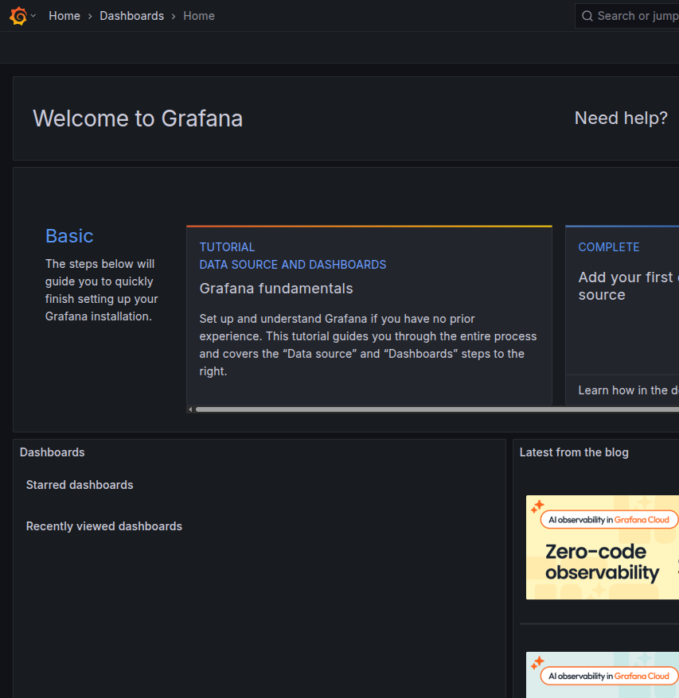
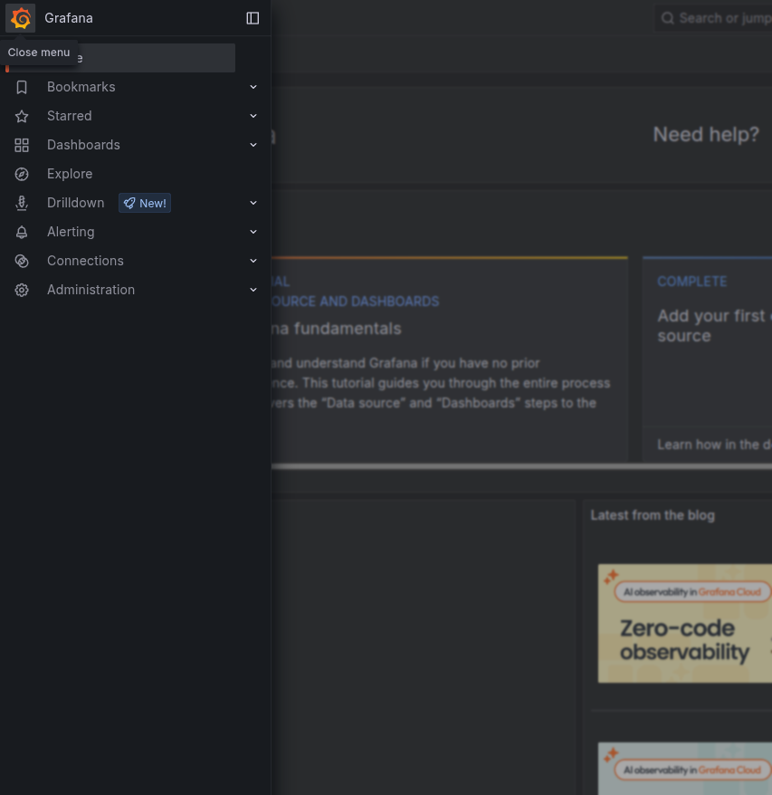
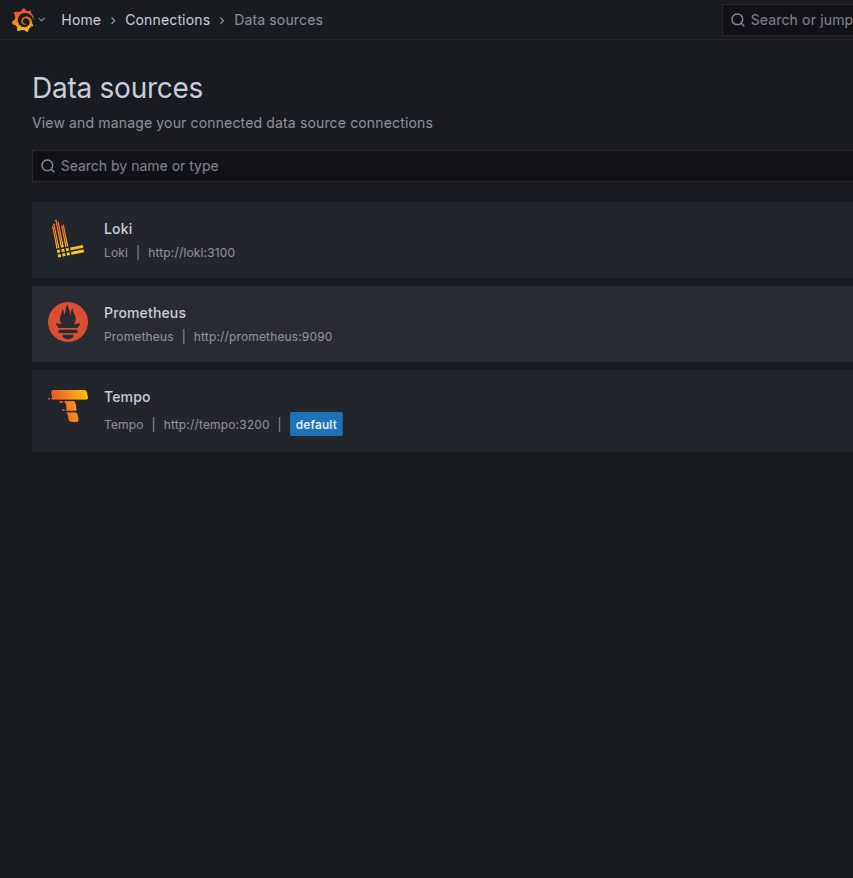
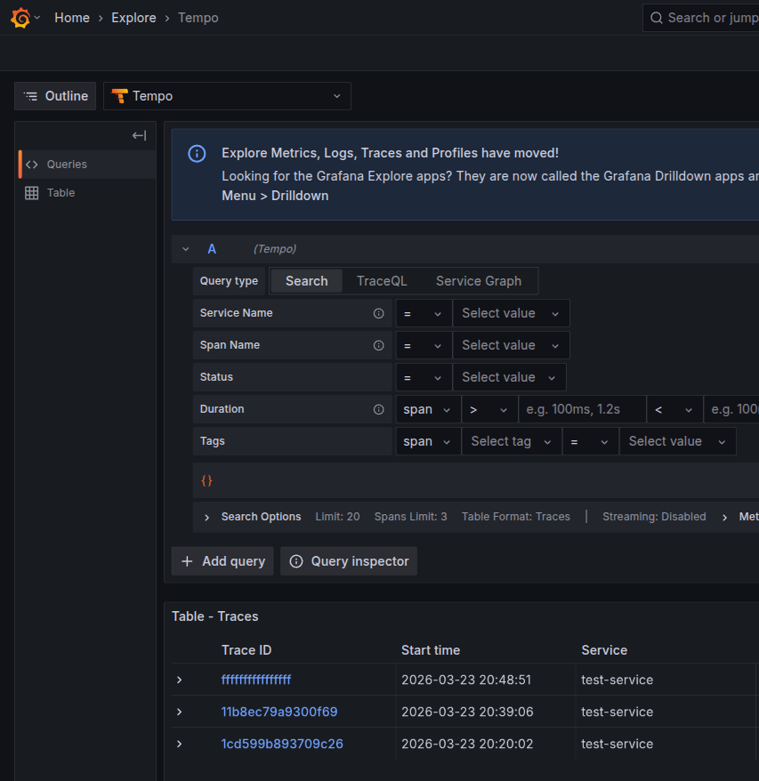
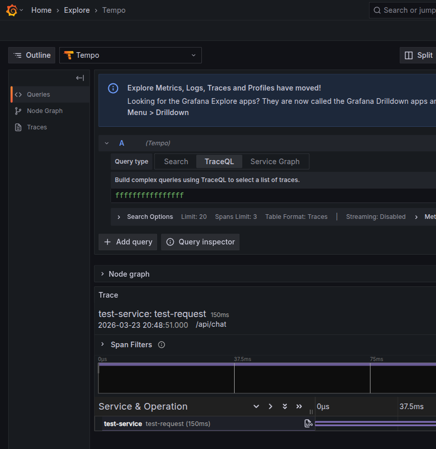
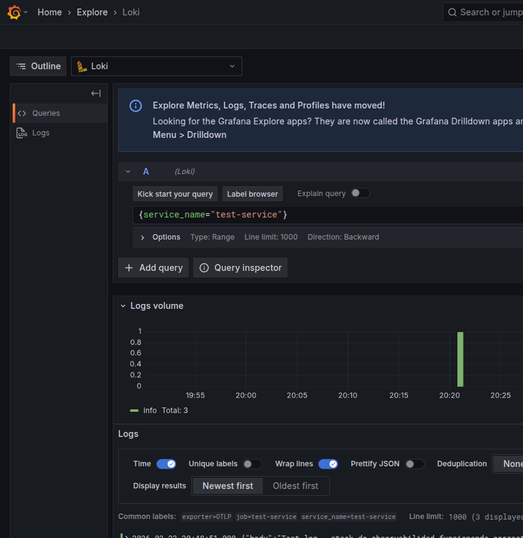
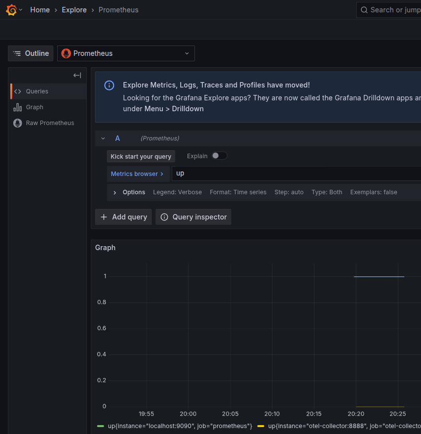

# Manual de Validación — Grafana UI

Este documento describe paso a paso cómo validar que el stack de observabilidad está funcionando correctamente utilizando la interfaz gráfica de Grafana. Cubre la verificación de las tres señales: **trazas** (Tempo), **logs** (Loki) y **métricas** (Prometheus).

---

## Tabla de Contenido

1. [Prerrequisitos](#1-prerrequisitos)
2. [Acceso a Grafana](#2-acceso-a-grafana)
3. [Navegación Principal](#3-navegación-principal)
4. [Verificar Datasources](#4-verificar-datasources)
5. [Validación de Trazas (Tempo)](#5-validación-de-trazas-tempo)
6. [Validación de Logs (Loki)](#6-validación-de-logs-loki)
7. [Validación de Métricas (Prometheus)](#7-validación-de-métricas-prometheus)
8. [Correlación entre Señales](#8-correlación-entre-señales)
9. [Checklist de Validación](#9-checklist-de-validación)

---

## 1. Prerrequisitos

Antes de iniciar la validación, asegúrate de que:

1. El stack está corriendo:
   ```bash
   docker compose up -d
   docker compose ps    # Los 5 servicios deben estar en estado "Up"
   ```

2. Hay telemetría de prueba en el sistema:
   ```bash
   ./scripts/test-telemetry.sh
   ```
   El script debe mostrar `✓` en las tres señales (trace, métrica, log).

3. Grafana está accesible en `http://localhost:3001`.

---

## 2. Acceso a Grafana

Abre `http://localhost:3001` en el navegador. Si ves la pantalla de bienvenida, ya estás logueado como usuario anónimo (Viewer). Para acceder a todas las funcionalidades, inicia sesión:

1. Click en **Sign in** (esquina superior derecha).
2. Credenciales: `admin` / `admin` (o la contraseña configurada).
3. Al hacer login, verás la pantalla de inicio con el menú completo habilitado.



> **Nota:** Como usuario anónimo (Viewer) no tendrás acceso al menú **Explore**. Es necesario iniciar sesión como administrador para realizar las validaciones.

---

## 3. Navegación Principal

Haz click en el ícono de hamburguesa (☰) en la esquina superior izquierda para abrir el menú lateral. Los elementos relevantes para la validación son:

| Menú | Función | Cuándo usarlo |
|------|---------|---------------|
| **Explore** | Consultas ad-hoc contra los datasources | Validar trazas, logs y métricas |
| **Dashboards** | Ver y crear dashboards con paneles | Monitoreo continuo |
| **Connections → Data Sources** | Ver y configurar datasources | Verificar que los backends están conectados |
| **Alerting** | Configurar alertas | Configurar notificaciones |



---

## 4. Verificar Datasources

Antes de consultar datos, verifica que los tres datasources están correctamente conectados.

### Paso a paso

1. Menú lateral → **Connections** → **Data sources**.
2. Debes ver los tres datasources pre-configurados:
   - **Loki** — `http://loki:3100` — backend de logs
   - **Prometheus** — `http://prometheus:9090` — backend de métricas
   - **Tempo** — `http://tempo:3200` — backend de trazas (marcado como `default`)



### Validación

- Los tres datasources deben aparecer en la lista.
- Click en cada uno → scroll al final → click en **Test** → debe responder `Data source is working`.
- Si alguno falla, verifica que el servicio correspondiente está corriendo con `docker compose ps`.

---

## 5. Validación de Trazas (Tempo)

Las trazas permiten seguir el camino de una request a través de la aplicación. Cada traza contiene uno o más **spans** con información de duración, servicio, ruta y atributos.

### 5.1 Buscar trazas

1. Menú lateral → **Explore**.
2. En el selector de datasource (esquina superior izquierda), seleccionar **Tempo**.
3. En **Query type**, seleccionar **Search**.
4. Dejar los filtros vacíos para ver todas las trazas.
5. Click en **Run query** (botón azul) o presionar `Shift+Enter`.

Aparece una tabla con las trazas encontradas:

| Columna | Descripción |
|---------|-------------|
| **Trace ID** | Identificador único de la traza (clickeable) |
| **Start time** | Fecha y hora de inicio |
| **Service** | Nombre del servicio que generó la traza |
| **Name** | Nombre del span raíz |
| **Duration** | Duración total de la traza |



### Criterio de aceptación

- La tabla debe mostrar al menos una traza del `test-service`.
- El campo **Name** debe ser `test-request`.
- La **Duration** debe ser `150 ms` (valor del script de prueba).

### 5.2 Ver detalle de una traza

1. Click en el **Trace ID** de cualquier traza.
2. Se abre la vista de detalle con:
   - **Encabezado:** `test-service: test-request 150ms` con timestamp y ruta `/api/chat`.
   - **Timeline visual:** Barra que muestra la duración del span con escala de tiempo.
   - **Service & Operation:** Lista de spans con su servicio, operación y duración.
   - **Botón de logs:** Ícono de documento junto al span para navegar a los logs correlacionados en Loki.



### Criterio de aceptación

- El span debe mostrar `test-service` como servicio y `test-request` como operación.
- La duración debe ser `150ms`.
- La ruta debe mostrar `/api/chat`.
- El ícono de logs (📄) debe estar visible junto al span.

### 5.3 Búsqueda por Trace ID

También puedes buscar una traza específica por su ID:

1. En **Query type**, seleccionar **TraceQL**.
2. En el campo de texto, pegar el Trace ID (ej: `11b8ec79a9300f69`).
3. Presionar `Shift+Enter`.

---

## 6. Validación de Logs (Loki)

Los logs son registros estructurados en formato JSON que contienen el cuerpo del mensaje, severidad, atributos y metadata del recurso — incluyendo `trace_id` para correlación.

### 6.1 Consultar logs

1. En **Explore**, cambiar el datasource a **Loki** (click en el selector y elegir Loki).
2. Cambiar a modo **Code** (radiobutton en la esquina superior derecha del editor).
3. Escribir la query LogQL:
   ```
   {service_name="test-service"}
   ```
4. Click en **Run query** o `Shift+Enter`.

Se muestran dos secciones:

- **Logs volume:** Gráfico de barras con la distribución temporal de logs.
- **Logs:** Lista de logs con timestamp y contenido JSON.



### Criterio de aceptación

- El gráfico de **Logs volume** debe mostrar barras con datos (Total > 0).
- Cada log debe contener en su JSON:
  - `"body": "Test log — stack de observabilidad funcionando correctamente"`
  - `"severity": "INFO"`
  - `"trace_id"` con un valor válido (hex string)
  - `"span_id"` con un valor válido
  - `"service.name": "test-service"` en resources
- Los **Common labels** deben mostrar: `exporter=OTLP`, `job=test-service`, `service_name=test-service`.

### 6.2 Filtrar por trace_id

Para buscar los logs de una traza específica:

```
{service_name="test-service"} |= "TRACE_ID_AQUI"
```

Reemplazar `TRACE_ID_AQUI` con el Trace ID obtenido en la sección anterior.


---

## 7. Validación de Métricas (Prometheus)

Las métricas son mediciones numéricas a lo largo del tiempo. Prometheus las recolecta de dos formas: remote write desde el Collector y scrape de los servicios del stack.

### 7.1 Consultar métricas

1. En **Explore**, cambiar el datasource a **Prometheus**.
2. En modo **Code**, escribir la query PromQL:
   ```
   up
   ```
3. Click en **Run query**.

Se muestran dos secciones:

- **Graph:** Gráfico de líneas con las series temporales.
- **Raw Prometheus:** Tabla con los valores actuales de cada serie.



### Criterio de aceptación

- La query `up` debe retornar al menos 3 series:
  - `up{instance="localhost:9090", job="prometheus"}` → valor `1` (Prometheus está vivo)
  - `up{instance="otel-collector:8888", job="otel-collector"}` → valor `1` (Collector está vivo)
  - `up{instance="tempo:3200", job="tempo"}` → valor `1` (Tempo está vivo)
- El gráfico debe mostrar líneas estables en valor `1` para los servicios activos.

### 7.2 Queries útiles para validación

| Query PromQL | Qué valida |
|-------------|------------|
| `up` | Estado de los servicios scrapeados |
| `otelcol_receiver_accepted_spans_total` | Spans recibidos por el Collector |
| `otelcol_exporter_sent_spans_total` | Spans enviados por el Collector a Tempo |
| `otelcol_exporter_send_failed_spans_total` | Errores de envío a backends |
| `prometheus_tsdb_head_series` | Cantidad de series activas en Prometheus |
| `tempo_distributor_spans_received_total` | Spans recibidos por Tempo |

### 7.3 Tipos de visualización

En la sección **Graph**, puedes cambiar entre visualizaciones:

| Tipo | Uso |
|------|-----|
| **Lines** | Series temporales continuas (default) |
| **Bars** | Comparar valores discretos |
| **Points** | Ver puntos individuales de datos |
| **Stacked lines** | Ver contribución de cada serie al total |
| **Stacked bars** | Comparar proporciones entre series |

---

## 8. Correlación entre Señales

Una de las ventajas principales del stack es la correlación automática entre señales vía `trace_id`. Esto permite navegar de un log a su traza, y viceversa.

### De traza a logs

1. En **Explore → Tempo**, abrir el detalle de una traza.
2. En la sección **Service & Operation**, buscar el ícono de documento (📄) junto al span.
3. Click en el ícono → se abre un split view con los logs de Loki filtrados por el `trace_id` de esa traza.

### De logs a traza

1. En **Explore → Loki**, ejecutar una query que retorne logs.
2. Click en **See log details** (ícono de ojo junto a un log).
3. En los campos del log, buscar `trace_id`.
4. Click en el link **Ver trace en Tempo** → navega directamente al trace en Tempo.

> **Nota:** La correlación funciona porque los datasources están configurados con `derivedFields` (Loki → Tempo) y `tracesToLogsV2` (Tempo → Loki) en el archivo `grafana/provisioning/datasources/datasources.yaml`.

---