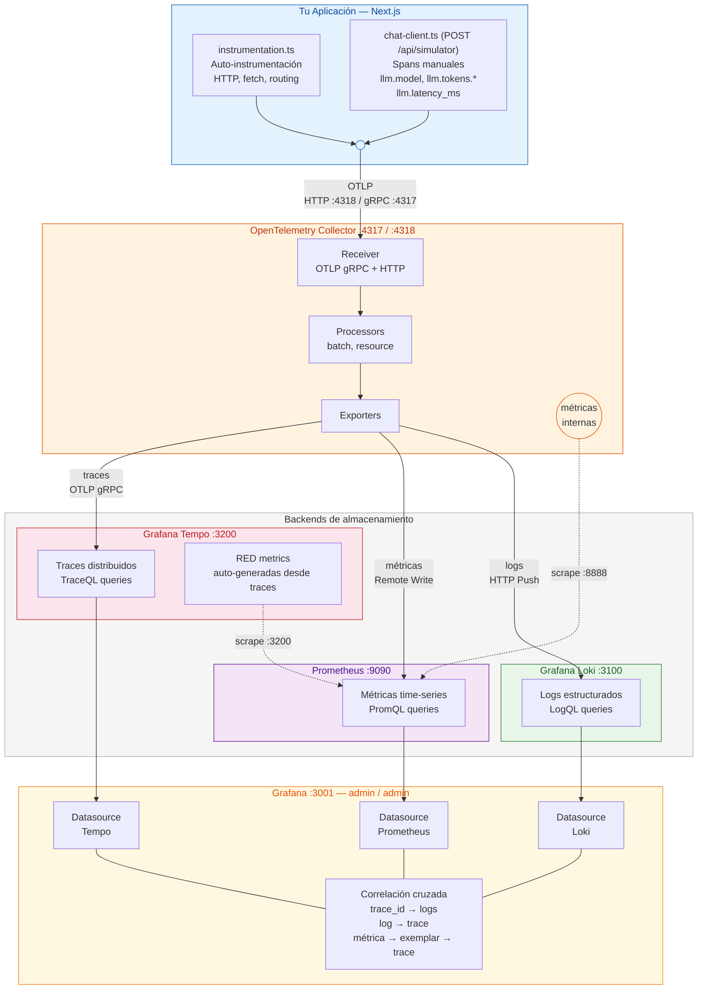

# OpenTelemetry Stack — Observabilidad Completa con Docker Compose

Stack de observabilidad opensource listo para usar. Un solo `docker compose up -d` levanta todo el ecosistema: colecta, almacenamiento y visualización de traces, métricas y logs.

## Arquitectura



### Flujo de datos

1. La aplicación envía traces, métricas y logs al **Collector** vía OTLP (puerto `4318` HTTP o `4317` gRPC).
2. El Collector agrupa los datos en batches y los distribuye a cada backend:
   - **Traces → Tempo** vía OTLP gRPC.
   - **Métricas → Prometheus** vía remote write.
   - **Logs → Loki** vía HTTP push.
3. **Tempo** genera automáticamente RED metrics (Rate, Errors, Duration) desde los traces y las envía a Prometheus.
4. **Prometheus** scrapea métricas internas del Collector (`:8888`) y de Tempo (`:3200`) para monitorear la salud del stack.
5. **Grafana** consulta los tres backends y permite correlacionar señales: click en un log navega al trace, click en una métrica navega al exemplar.

### Puertos

| Servicio | Puerto | Uso |
|----------|--------|-----|
| Grafana | `3001` | UI de visualización (evita conflicto con Next.js en 3000) |
| OTel Collector | `4317` | OTLP gRPC — endpoint principal para apps |
| OTel Collector | `4318` | OTLP HTTP — alternativa para apps sin soporte gRPC |
| OTel Collector | `8888` | Métricas internas del Collector |
| Prometheus | `9090` | UI y API de Prometheus |
| Loki | `3100` | API de Loki |
| Tempo | `3200` | API de Tempo |

---

## Cómo correr

### Levantar el stack

```bash
docker compose up -d
```

Verificar que los 5 servicios están corriendo:

```bash
docker compose ps
```

Resultado esperado: `otel-collector`, `tempo`, `prometheus`, `loki`, `grafana` — todos en estado `Up`.

### Probar que funciona

El script envía un trace, una métrica y un log de prueba al Collector:

```bash
./scripts/test-telemetry.sh
```

Si los tres muestran `✓`, el stack está funcionando. El script imprime las URLs y queries para verificar en Grafana.

### Detener el stack

```bash
# Detener sin borrar datos (los volúmenes persisten)
docker compose down

# Detener y borrar todos los datos
docker compose down -v
```

### Reiniciar un servicio específico

```bash
docker compose restart otel-collector
docker compose restart grafana
```

---

## Diagnóstico

### Ver logs de un servicio

```bash
# Logs en tiempo real del Collector (más útil para debug)
docker compose logs -f otel-collector

# Logs de Tempo
docker compose logs -f tempo

# Logs de todos los servicios
docker compose logs -f

# Últimas 50 líneas de un servicio
docker compose logs --tail 50 otel-collector
```

### Verificar que el Collector está recibiendo datos

El Collector expone métricas internas en `:8888`:

```bash
# Ver si hay spans recibidos
curl -s http://localhost:8888/metrics | grep otelcol_receiver_accepted

# Ver si hay errores de exportación
curl -s http://localhost:8888/metrics | grep otelcol_exporter_send_failed
```

### Verificar salud de cada backend

```bash
# Tempo — debe responder con "ready"
curl -s http://localhost:3200/ready

# Prometheus — debe responder con status "success"
curl -s http://localhost:9090/api/v1/status/runtimeinfo | python3 -m json.tool | head -5

# Loki — debe responder con "ready"
curl -s http://localhost:3100/ready

# Grafana — debe responder con status 200
curl -s -o /dev/null -w "%{http_code}" http://localhost:3001/api/health
```

### Problemas comunes

| Problema | Diagnóstico | Solución |
|----------|-------------|----------|
| Collector no levanta | `docker compose logs otel-collector` | Revisar YAML de configuración (indentación) |
| Traces no aparecen en Tempo | `curl localhost:8888/metrics \| grep exporter` | Verificar que Tempo está corriendo y accesible en la red |
| Métricas no llegan a Prometheus | Revisar logs del Collector buscando `remote_write` | Verificar que `web.enable-remote-write-receiver` está habilitado |
| Logs no aparecen en Loki | `docker compose logs loki` | Verificar endpoint del exporter en el Collector |
| Grafana no muestra datos | Ir a Settings → Data Sources → Test | Verificar que los contenedores están en la misma red Docker |
| Puerto 3001 ocupado | `lsof -i :3001` | Cambiar el puerto en `docker-compose.yml` (línea de Grafana) |

---

## Comandos útiles

### Consultar Tempo (traces)

```bash
# Buscar un trace por ID
curl -s http://localhost:3200/api/traces/<TRACE_ID> | python3 -m json.tool

# Buscar traces recientes (últimos 5 minutos)
curl -s "http://localhost:3200/api/search?q=%7B%7D&limit=10" | python3 -m json.tool

# Buscar traces de un servicio específico
curl -s "http://localhost:3200/api/search?q=%7Bresource.service.name%3D%22mi-app%22%7D&limit=10" | python3 -m json.tool
```

### Consultar Prometheus (métricas)

```bash
# Listar todas las métricas disponibles
curl -s http://localhost:9090/api/v1/label/__name__/values | python3 -m json.tool

# Ejecutar una query PromQL
curl -s "http://localhost:9090/api/v1/query?query=up" | python3 -m json.tool

# Métricas del Collector: spans recibidos por servicio
curl -s 'http://localhost:9090/api/v1/query?query=otelcol_receiver_accepted_spans_total' | python3 -m json.tool
```

### Consultar Loki (logs)

```bash
# Ver logs de un servicio
curl -s -G http://localhost:3100/loki/api/v1/query_range \
  --data-urlencode 'query={service_name="mi-app"}' \
  --data-urlencode 'limit=10' | python3 -m json.tool

# Ver logs que contienen un trace_id específico
curl -s -G http://localhost:3100/loki/api/v1/query_range \
  --data-urlencode 'query={service_name=~".+"} |= "<TRACE_ID>"' \
  --data-urlencode 'limit=5' | python3 -m json.tool

# Ver labels disponibles
curl -s http://localhost:3100/loki/api/v1/labels | python3 -m json.tool
```

### Enviar telemetría manual (útil para testing)

```bash
# Enviar un trace de prueba al Collector
curl -X POST http://localhost:4318/v1/traces \
  -H "Content-Type: application/json" \
  -d '{
    "resourceSpans": [{
      "resource": {
        "attributes": [
          {"key": "service.name", "value": {"stringValue": "test"}}
        ]
      },
      "scopeSpans": [{
        "scope": {"name": "manual-test"},
        "spans": [{
          "traceId": "'$(printf '%032x' $RANDOM$RANDOM$RANDOM$RANDOM)'",
          "spanId": "'$(printf '%016x' $RANDOM$RANDOM)'",
          "name": "test-span",
          "kind": 2,
          "startTimeUnixNano": "'$(date +%s)000000000'",
          "endTimeUnixNano": "'$(date +%s)100000000'",
          "status": {"code": 1}
        }]
      }]
    }]
  }'
```

---

## Estructura de archivos

```
otel-stack/
├── docker-compose.yml                          # Define los 5 servicios y sus volúmenes
├── otel-collector/
│   └── otel-collector-config.yaml              # Pipelines: receivers → processors → exporters
├── tempo/
│   └── tempo-config.yaml                       # Backend de traces + generación de RED metrics
├── prometheus/
│   └── prometheus.yml                          # Scrape targets: Collector y Tempo
├── loki/
│   └── loki-config.yaml                        # Backend de logs con retención de 7 días
├── grafana/
│   └── provisioning/
│       ├── datasources/
│       │   └── datasources.yaml                # Tempo + Prometheus + Loki pre-conectados
│       └── dashboards/
│           └── dashboards.yaml                 # Provider para cargar dashboards JSON
└── scripts/
    └── test-telemetry.sh                       # Envía trace + métrica + log de prueba
```

### Configuración de cada componente

| Archivo | Qué configurar | Cuándo tocarlo |
|---------|---------------|----------------|
| `otel-collector-config.yaml` | Agregar receivers, processors o exporters | Si necesitas recibir datos en otro formato o exportar a otro backend |
| `tempo-config.yaml` | Retención, compactación, RED metrics | Si necesitas más o menos retención de traces |
| `prometheus.yml` | Agregar scrape targets | Si agregas servicios que exponen métricas en `/metrics` |
| `loki-config.yaml` | Retención, límites de ingesta | Si los logs crecen demasiado o necesitas más retención |
| `datasources.yaml` | Agregar nuevos datasources a Grafana | Si agregas un backend nuevo al stack |

---

## Conectar tu aplicación

Para enviar telemetría desde tu app al stack, configura la variable de entorno:

```bash
OTEL_EXPORTER_OTLP_ENDPOINT=http://localhost:4318
```

Si la app corre dentro de Docker en la misma red:

```bash
OTEL_EXPORTER_OTLP_ENDPOINT=http://otel-collector:4318
```

El Collector acepta traces, métricas y logs en el mismo endpoint. El SDK de OpenTelemetry se encarga de enviar cada señal al path correcto (`/v1/traces`, `/v1/metrics`, `/v1/logs`).
