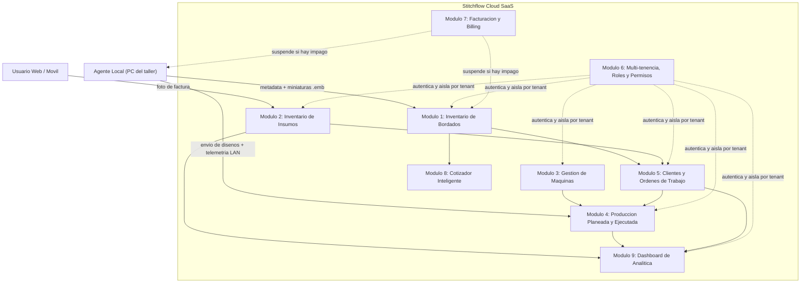

# PRD — Stitchflow

> Generado por co-creación iterativa (Prompt 1 de `prompts-especificacion.md`) a partir de `docs/PVB copy.md` y las 9 especificaciones de módulo en `docs/`. Todos los segmentos fueron aprobados por el creador del producto.

---

## 0. Decisiones y Supuestos Clave (resumen)

Antes de leer el PRD, ten en cuenta estas decisiones tomadas durante la co-creación (detalle completo del análisis en el historial de la conversación):

1. **Sin `mercado.md`, `icp.md`, `critica.md` ni transcripciones de clientes en `docs/`.** El PRD avanza con TBDs explícitos en tamaño de mercado, timing ("por qué ahora"), geografía y triggers de compra. Estos deben validarse con el piloto real.
2. **Las specs de los 9 módulos describen, en parte, un taller piloto concreto** (3 máquinas, horario fijo). En este PRD se tratan como ejemplo ilustrativo y se generalizan a "N máquinas configurables por tenant".
3. **Pricing:** se asume tarifa plana de $200 USD/mes (como dice el texto del PVB y Módulo 7), no "Hybrid Tiered" (el checkbox del PVB se considera un error de captura).
4. **Moat primario = Distribution Moat** (Agente Local embebido en el taller). El modelo predictivo global del Cotizador (Módulo 8, Fase 2) es un moat secundario futuro, condicionado a opt-in explícito de cada tenant — no rompe el aislamiento multi-tenant porque requiere consentimiento (ver Principio de Diseño 5).
5. **"Capability-first"** (AI Decision Triangle del PVB) aplica a los flujos de IA (facturas, `.emb`, cotizador), no a la capa operativa/analítica, que sí exige baja latencia (dashboard < 2s).
6. **Kill-switch de Módulo 7** (bloqueo inmediato sin días de gracia) queda documentado como riesgo abierto (Riesgo #6, sección 12) — se recomienda validar con el piloto si debe permitir terminar un trabajo ya montado en máquina antes de bloquear.

---

## 1. One-Liner del Producto + Job to be Done (JTBD)

**One-liner:**
Stitchflow es el sistema operativo de producción para talleres de bordado industrial: convierte el catálogo histórico de diseños, las facturas de insumos y la capacidad real de las máquinas en una cola de producción calculada automáticamente. En vez de que el jefe de taller estime "a ojo" cuánto hilo gastar o en qué máquina montar un pedido, Stitchflow lo calcula a partir de la data técnica real de cada diseño.

**JTBD principal:**
*Cuando* recibo un nuevo pedido de bordado y necesito decidir si tengo insumos suficientes y en qué máquina montarlo, *quiero* que el sistema cruce automáticamente los datos técnicos del diseño con mi inventario real y la capacidad de mis máquinas, *para* poder prometer fechas de entrega realistas sin arriesgarme a parar la producción a mitad de un lote por falta de material.

**Misión del producto:**
Eliminar la incertidumbre operativa de los talleres de bordado industrial dándoles visibilidad total sobre su catálogo de diseños, su inventario físico y la capacidad real de sus máquinas. Los agentes de IA de Stitchflow hacen el trabajo manual y propenso a error —leer archivos técnicos binarios, interpretar facturas, secuenciar máquinas— para que el jefe de producción solo tenga que validar y decidir.

---

## 2. Contexto y Problema

**Dolores del mercado:**

1. **Catálogo histórico invisible.** Talleres con hasta **70,000 archivos `.emb`** dispersos en carpetas locales, sin forma de buscarlos, reutilizarlos o cotizarlos sin abrir el software de diseño uno por uno.
2. **Insumos calculados "a ojo".** No existe cruce real entre las puntadas/colores de un diseño y el inventario físico en bodega; el resultado son paradas de máquina a mitad de lote por falta de material.
3. **Scheduling empírico.** La asignación de órdenes a máquinas no considera cabezales, cambios de color ni tiempos de preparación, generando máquinas ociosas y retrasos de entrega.

> **TBD — Tamaño y crecimiento de mercado:** no hay datos duros en `docs/`. Validar con investigación de mercado antes de definir TAM/SAM/SOM.
> **TBD — "Por qué ahora":** hipótesis a validar — (a) abaratamiento de visión IA/LLMs, (b) presión de márgenes en el sector textil/maquila, (c) recambio generacional hacia dueños de taller más digitales.

**Alternativas actuales (qué usa el ICP hoy y por qué es insuficiente):**

- **Excel y tablero físico:** el fallback al que el propio PVB identifica como "enemigo" — si Stitchflow exige demasiada data manual o sugiere algo poco realista, el jefe de producción vuelve al tablero físico o Excel.
- **ERPs/software de inventario genérico:** requieren digitación manual de cada insumo, hilo o campo de pedido; fracasan en el día a día caótico de una confección.
- **Herramientas de IA/visión genéricas:** existen pero no entienden la lógica de producción de un taller de bordado — no cruzan colores de hilo con marcas locales ni leen formatos propietarios como `.emb`.

---

## 3. ICP Detallado

**Perfil y firmographics:**

| Dimensión | Dato |
|---|---|
| Sector | Talleres y fábricas de confección, publicidad y maquila de bordado industrial |
| Tamaño | Pequeños talleres con catálogo masivo de diseños digitalizados (ejemplo del piloto: 3 máquinas multicabezal) |
| Geografía | TBD — probablemente mercados hispanohablantes con alta adopción de WhatsApp; falta confirmar país/región ancla |
| Madurez de operación | Procesos manuales/Excel/tablero físico, catálogo histórico grande pero desorganizado |

**Buyer personas:**

1. **Dueño / Administrador del taller** — *Economic buyer.* Controla presupuesto, ve el módulo financiero completo, gestiona la suscripción del SaaS.
2. **Supervisor / Jefe de Producción** — *Champion y veto de confianza.* No siempre paga, pero puede matar la adopción si el sistema exige demasiada data manual o sugiere asignaciones poco realistas. En talleres pequeños suele coincidir con el dueño.
3. **Operario de máquina** — *Usuario final, no decisor de compra.* Consume una cola de trabajo desde una interfaz ultra-simplificada.

**Pains por persona:**

- **Dueño/Administrador:** sin visibilidad de ganancia neta real por orden hasta calcularla a mano; asume el riesgo financiero de un kill-switch por fallo de cobro.
- **Jefe de Producción:** calcula consumo de insumos "al ojo"; programa máquinas de forma empírica sin considerar cabezales o cambios de color.
- **Operario:** hoy recibe indicaciones verbales o memorias USB para cargar diseños en la máquina.

**Triggers de compra (hipótesis, requieren validación):**
- Incidente costoso reciente: máquina parada a mitad de turno por falta de insumo en un pedido urgente.
- Crecimiento que rompe el Excel: el catálogo local se vuelve inmanejable.
- Pérdida de una cotización grande por lentitud en responder al cliente.

**Objeciones probables y cómo responderlas:**

| Objeción | Respuesta |
|---|---|
| "Ya tengo mi proceso en Excel/papel y funciona" | Cuantificar el costo real de una parada de máquina vs. el costo de la suscripción; el ROI se paga con evitar un incidente al mes. |
| "No quiero que un software externo escanee mis diseños" | El Agente Local procesa los `.emb` en la propia máquina del cliente; solo sube metadata + miniatura comprimida, nunca el archivo original. Aislamiento estricto por tenant. |
| "$200/mes es caro para mi taller pequeño" | Posicionar como partner estratégico con descuento vitalicio para adoptantes tempranos; inversión que se paga con la primera parada de máquina evitada. |
| "¿Qué pasa si la IA lee mal una factura y descuadra mi inventario?" | Paso de validación visual obligatorio antes de asentar cualquier factura en el inventario real. |

---

## 4. Propuesta de Valor Única (UVP) y Diferenciadores

**¿Qué problema resuelve? ¿Para quién? ¿Cómo?**
Stitchflow resuelve la desconexión entre el diseño digital, el inventario físico y la máquina real en talleres de bordado industrial. Es para el dueño/jefe de producción que hoy decide "a ojo" si puede aceptar y programar un pedido. Lo hace desplegando un Agente Local que lee los `.emb` del taller y un agente de visión que lee facturas de insumos, cruzando ambos con la capacidad real de cada máquina.

**Diferenciación vs. competidores (categorías, sin nombres propios — no hay benchmark competitivo en `docs/`):**

| Competidor | Por qué es insuficiente | Cómo gana Stitchflow |
|---|---|---|
| Excel / tablero físico | Cero automatización, cero trazabilidad | Reemplaza la hoja de cálculo con datos estructurados y agentes que digitan por el usuario |
| ERP / software de inventario genérico | Exige digitación manual, no entiende producción textil | Automatiza la carga vía IA y aplica fórmulas específicas del dominio |
| Herramientas de IA/visión genéricas | No conocen el workflow del taller ni formatos propietarios | Empaqueta la IA en un flujo vertical end-to-end: diseño → insumo → máquina |

**Brecha de mercado que llena:** ninguna alternativa actual cierra el ciclo completo "archivo de diseño → insumo físico → máquina física". Stitchflow es la única propuesta, según los docs, que conecta los tres extremos con un solo agente local embebido en el taller.

**Matriz de posicionamiento:**

```mermaid
quadrantChart
    title Posicionamiento: Especializacion Vertical vs. Automatizacion del Workflow
    x-axis Baja Especializacion en Bordado --> Alta Especializacion en Bordado
    y-axis Automatizacion Manual --> Automatizacion Agentica End-to-End
    quadrant-1 Lideres de Nicho Automatizados
    quadrant-2 Genericos Automatizados
    quadrant-3 Manual / Generico
    quadrant-4 Nicho pero Manual
    Excel / Tablero fisico: [0.08, 0.05]
    ERP generico de inventario: [0.25, 0.20]
    Herramientas IA genericas (Vision/OCR): [0.20, 0.55]
    Stitchflow: [0.85, 0.85]
```

---

## 5. Casos de Uso Top 5

### UC1. Búsqueda instantánea en el catálogo histórico
- **Actor:** Jefe de Producción / Supervisor
- **Trigger:** Un cliente pide repetir un diseño anterior o algo similar
- **Steps:** Agente Local escanea `.emb` → extrae metadata y genera miniatura → sincroniza a la nube → usuario busca por nombre/rango/tags → encuentra el diseño
- **Resultado esperado:** Encuentra el diseño sin abrir archivos uno por uno
- **KPI:** Setup Time Optimization — meta <5s por búsqueda

### UC2. Carga de inventario de insumos por foto de factura
- **Actor:** Administrador / Jefe de Producción
- **Trigger:** Llega mercancía nueva al taller
- **Steps:** Foto de la factura → IA extrae proveedor/ítem/cantidad/precio → concilia contra insumos existentes o alerta "nuevo" → usuario valida → stock se actualiza
- **Resultado esperado:** Inventario actualizado sin digitación manual ni descuadre silencioso
- **KPI:** Invoice Line-Item Extraction Accuracy

### UC3. Creación de Orden de Trabajo con margen validado
- **Actor:** Administrador / Dueño
- **Trigger:** Se acuerda un pedido con un cliente
- **Steps:** Crea la OT → vincula diseño existente o marca "nuevo" → sistema cruza puntadas con fórmula de consumo → calcula costo y ganancia neta → confirma solo si el margen es aceptable
- **Resultado esperado:** El dueño sabe la rentabilidad real antes de comprometerse
- **KPI:** % de OTs confirmadas con margen validado previo a producción

### UC4. Programación automática de máquinas (scheduling)
- **Actor:** Jefe de Producción / Supervisor
- **Trigger:** Cola de órdenes pendientes con varias máquinas disponibles
- **Steps:** Sistema cruza requisitos del bordado con la ficha técnica de cada máquina → aplica reglas de prioridad → genera cronograma sugerido → jefe aprueba/ajusta → envía diseño con un clic
- **Resultado esperado:** Menos máquinas ociosas, asignación que respeta restricciones técnicas reales
- **KPI:** Machine Downtime Reduction

### UC5. Rastreo público del pedido por el cliente final
- **Actor:** Cliente final del taller (externo, sin login)
- **Trigger:** El cliente quiere saber en qué va su pedido
- **Steps:** Recibe ID único de rastreo → abre URL pública → ve estado animado (Espera/Trabajando/Empacando/Listo) → recibe WhatsApp cuando está listo
- **Resultado esperado:** El cliente final no necesita llamar preguntando por su pedido
- **KPI:** Reducción de consultas manuales de estado

---

## 6. Principios de Diseño No Negociables

### 1. Validación humana obligatoria antes de comprometer inventario o finanzas
- **Operativo:** ninguna extracción de IA se escribe como dato definitivo sin confirmación humana.
- **Interfaz:** pantalla de revisión con campos editables y paso explícito de "Confirmar".
- **PROHIBIDO:** auto-commit silencioso de datos de IA a inventario o finanzas.

### 2. Aislamiento estricto de datos por tenant
- **Operativo:** cada fila de cada tabla lleva `tenant_id`; todo query se filtra automáticamente.
- **Interfaz:** invisible al usuario — no existe ningún selector cross-tenant.
- **PROHIBIDO:** mezclar datos entre tenants, incluyendo su uso para entrenar modelos de IA compartidos sin consentimiento explícito (ver principio 5).

### 3. Minimización de datos sensibles que salen del taller
- **Operativo:** el `.emb` original nunca sale del disco del cliente; solo metadata y miniatura comprimida se sincronizan.
- **Interfaz:** la galería web siempre muestra miniaturas, nunca ofrece descargar el original desde la nube.
- **PROHIBIDO:** subir o almacenar el archivo binario original en la nube.

### 4. Confidencialidad financiera basada en rol
- **Operativo:** margen neto, costo de insumos y datos de facturación visibles solo para Administrador.
- **Interfaz:** condicionado por rol a nivel de backend, no solo ocultado en el frontend.
- **PROHIBIDO:** que Supervisor u Operario vean, exporten o infieran el margen de ganancia o costos de facturación.

### 5. Consentimiento explícito para uso de datos en el modelo predictivo compartido
- **Operativo:** ningún dato de un tenant se usa para entrenar el modelo global del Cotizador Fase 2 sin consentimiento explícito.
- **Interfaz:** toggle visible en configuración de cuenta, comunicado activamente en onboarding, no habilitado por defecto de forma silenciosa.
- **PROHIBIDO:** data harvesting silencioso sin ese consentimiento visible.

---

## 7. User Journeys

### 1. Happy Path — Usuario final (Jefe de Producción)
1. Abre Stitchflow y ve la cola de producción del día ya priorizada.
2. Un cliente pide un diseño urgente; lo encuentra en el catálogo en segundos.
3. El sistema muestra que el hilo azul está en amarillo pero alcanza para esta orden.
4. Aprueba el pedido; al ser cliente premium, el sistema reordena la cola automáticamente.
5. Envía el diseño a la máquina disponible con un clic.
6. Al cierre revisa el tablero: 3 OT pasaron a "Listo para Entregar" y ya se notificó por WhatsApp.

### 2. Happy Path — Operador/Administrador
1. Se suscribe y configura su cuenta como tenant nuevo.
2. Instala el Agente Local con su token único; empieza la indexación masiva por lotes.
3. Configura la ficha técnica de sus máquinas y el calendario laboral.
4. Carga sus primeras facturas por foto, incluyendo hilos abiertos con % restante.
5. Revisa semanalmente el Dashboard de Analítica.
6. Recibe alerta de estacionalidad baja y activa la promoción sugerida por WhatsApp.

### 3. Edge Case 1 — El flujo se interrumpe / el usuario abandona
*(Indexación masiva inicial se corta a mitad de proceso)*
1. Se inicia la indexación de 70,000 `.emb`.
2. A los 20 minutos (15,000 procesados) se corta el internet o el usuario apaga el equipo.
3. El Agente Local guarda un checkpoint local sin perder lo ya sincronizado.
4. Al reconectar, retoma automáticamente desde el archivo 15,001.
5. La interfaz muestra progreso claro ("15,000/70,000") en vez de error silencioso.
6. **Resultado esperado:** el usuario nunca necesita reiniciar manualmente el proceso.

### 4. Edge Case 2 — El agente no puede resolver y escala a un humano
*(OCR de factura con baja confianza en un insumo)*
1. Foto de factura borrosa o de un insumo nunca antes visto.
2. El modelo extrae los campos pero con baja confianza en el nombre del insumo.
3. El sistema no adivina: marca el campo "Necesita tu confirmación" con las opciones más probables.
4. El usuario elige o corrige manualmente.
5. Si es ilegible, se guarda como "pendiente de revisión" sin bloquear el resto de la factura.
6. **Resultado esperado:** ningún dato de baja confianza se asienta sin confirmación humana.

---

## 8. MVP Scope (MoSCoW)

**Must Have:**
- Agente Local + indexación de catálogo `.emb`, buscador y tags (Módulo 1 completo)
- Carga de insumos por foto, conciliación, semáforo (Módulo 2, secciones 3.1-3.3)
- Ficha técnica de máquinas y estados operativos (Módulo 3, secciones 2-3.1)
- Scheduling básico: FIFO + calendario + envío semiautomatizado (Módulo 4, secciones 2.2 y 3.1)
- Gestión de OT + motor financiero + tracker público (Módulo 5 completo)
- Multi-tenancy + RBAC de 3 roles (Módulo 6 completo)
- Billing core: cobro recurrente + kill-switch (Módulo 7, sección 3.2)

**Should Have:**
- Notificaciones automatizadas WhatsApp/SMS
- Matriz de pesos heurísticos para clientes premium
- Telemetría IoT automática de tiempos muertos
- Mantenimiento preventivo automático de máquinas
- Dashboard de analítica básico (embudo de OT y telemetría)

**Could Have:**
- Cotizador Fase 1 (vectores/curvas)
- Motor de viabilidad financiera predictivo y detector de estacionalidad
- Cobro de add-ons/personalizaciones

**Won't Have (por ahora):**
- Cotizador Fase 2: modelo predictivo de visión IA cross-tenant — requiere resolver primero el consentimiento explícito (Principio 5)
- Soporte multi-pasarela de pago — arrancar con una sola pasarela
- Expansión a múltiples calendarios fiscales/regulatorios por país

---

## 9. Especificación Funcional: Módulos y Features

| Módulo | Features principales | Roles / Permisos | Pantallas / Flows |
|---|---|---|---|
| 1. Inventario de Bordados | Escaneo Agente Local, extracción metadata, miniaturas, buscador, tags | Admin/Supervisor: completo. Operario: solo su cola asignada | Galería web, configurador del agente, buscador |
| 2. Inventario de Insumos | Carga por foto, conciliación IA, semáforo, fórmula de consumo, notificaciones | Admin/Supervisor gestionan. Operario: sin acceso | Carga de factura, listado de stock, config. de alertas |
| 3. Gestión de Máquinas | Ficha técnica, estados operativos, telemetría de uso, bitácora de mantenimiento | Admin: alta/baja. Supervisor: estados/telemetría. Operario: su máquina | Panel de máquinas, ficha técnica, bitácora |
| 4. Producción Planeada y Ejecutada | Priorización FIFO+pesos, calendario, cronograma Gantt, envío semiautomatizado, tiempos muertos | Supervisor: aprueba/ajusta/envía. Admin: visibilidad total. Operario: su cola del día | Vista Gantt, botón "Enviar a Máquina X", pantalla operario |
| 5. Gestión de Clientes y OT | CRM básico, generador de OT, motor financiero, tracker público, notificaciones | Admin: ve margen. Supervisor: crea/aprueba OT sin ver margen. Cliente: tracker sin login | Ficha cliente, creación de OT, tracker público, tablero de estados |
| 6. Multi-tenencia, Roles y Permisos | Auth, RLS por tenant_id, RBAC de 3 roles, tokens de agente | Solo Admin gestiona usuarios/roles/tokens | Panel de usuarios, config. del token del agente |
| 7. Facturación y Billing | Cobro recurrente, kill-switch, webhooks de pago | Solo Admin | Panel de suscripción, pantalla de bloqueo |
| 8. Cotizador Inteligente (Fase 1) | Carga de vector, extracción de dimensiones, puntadas estimadas, precio sugerido | Admin/Supervisor cotizan | Pantalla de cotizador |
| 9. Dashboard de Analítica | Embudo de OT, telemetría, capacidad teórica vs. real, viabilidad financiera, estacionalidad | Admin: completo. Supervisor: solo telemetría operativa | Dashboard BI con filtros de tiempo |

**Diagrama de arquitectura funcional de alto nivel:**



---

## 10. Métricas de Éxito

**Métrica North Star:** **Utilización Efectiva de Máquina (%)** = Horas reales de bordado ÷ Horas de capacidad teórica disponible. Conecta los tres dolores fundacionales (visibilidad de catálogo, insumos, scheduling) en una sola métrica.

> **TBD — Baseline actual:** ningún doc reporta la utilización actual de un taller típico. Validar con el taller piloto.

**KPIs de Activación:**

| KPI | Baseline | Meta |
|---|---|---|
| % de catálogo `.emb` indexado en los primeros 7 días | TBD | ≥95% sin corrupción |
| Tiempo hasta primera factura validada vía IA | TBD | <24h desde onboarding |
| % de máquinas con ficha técnica completa en semana 1 | TBD | 100% |

**KPIs de Retención:**

| KPI | Baseline | Meta |
|---|---|---|
| % de talleres que renuevan mes 2 | TBD | ≥90% |
| Días activos/semana usando scheduling/OT | TBD | ≥5 días/semana |
| Churn mensual | TBD | <5% mensual (fase co-creación) |

**KPIs de Calidad:**

| KPI | Baseline | Meta |
|---|---|---|
| Invoice Line-Item Extraction Accuracy | TBD | ≥95% |
| Metadata Extraction Success Rate | TBD | ≥99% |

**Métricas de calidad del agente:**
- **Factualidad:** % de extracciones confirmadas sin corrección manual. Meta ≥85%, alerta si <70%.
- **Utilidad:** % de sugerencias de cronograma aprobadas sin modificar. Meta ≥70%.
- **Seguridad:** 0 incidentes de fuga de datos cross-tenant; reacción inmediata del kill-switch tras impago.

---

## 11. Plan de Evaluación del Agente

**Dataset inicial (a recolectar del taller piloto antes de lanzar):**
- Facturas reales fotografiadas en condiciones variadas, con ground truth etiquetado manualmente.
- Muestra de archivos `.emb` con metadata ya verificada manualmente.
- Casos históricos/simulados de scheduling con la asignación "correcta" según el Jefe de Producción.

**Criterios de calidad:**
- **Factualidad:** precisión campo por campo contra ground truth en facturas; % de `.emb` procesados sin corrupción.
- **Adherencia a instrucciones:** el JSON Mode de extracción respeta el esquema exacto, sin campos inventados.
- **Cumplimiento de restricciones duras (gate de lanzamiento, no KPI de mejora continua):** 100% de las asignaciones de scheduling respetan las reglas técnicas (tambor, especialidad).

**QA de outputs:**
- Cada corrección del usuario sobre una extracción de IA se loggea como señal de error real.
- Muestreo semanal de extracciones confirmadas, revisado por el equipo de producto.
- Panel de discrepancias para casos con más de un campo corregido.

**Red-teaming:**
- Facturas manipuladas, borrosas, manuscritas, de proveedores nuevos, con montos absurdos.
- Archivos `.emb` corruptos o de formato no estándar.
- Intentos de acceso cruzado entre tenants con tokens ajenos.
- Escenarios de scheduling imposible (todas las máquinas incompatibles).

---

## 12. Riesgos y Mitigaciones

| # | Riesgo | Tipo | Prob. | Impacto | Mitigación |
|---|---|---|---|---|---|
| 1 | Alucinación de IA al leer una factura descuadra el inventario real | Técnico/Producto | Media | Alto | Validación humana obligatoria (Principio 1) |
| 2 | Parser del Agente Local corrompe/pierde metadata de un `.emb` no estándar | Técnico | Media | Alto | Parsing defensivo por archivo, checkpoints, red-teaming |
| 3 | Brecha de aislamiento multi-tenant expone datos entre talleres | Legal/Reputacional/Técnico | Baja | Muy Alto | RLS a nivel de BD, auditorías, red-teaming de acceso cruzado |
| 4 | Rechazo de adopción por el Jefe de Producción ("veto de confianza") | Producto/Adopción | Media-Alta | Alto | FIFO simple antes de heurística compleja, medir KPI de utilidad |
| 5 | Corte de conectividad o falla del Agente Local a mitad de proceso | Técnico/Operativo | Media | Medio | Checkpoints locales, reanudación automática, progreso visible |
| 6 | Kill-switch inmediato detiene producción física en curso por fallo de cobro ajeno al cliente | Legal/Reputacional/Producto | Media | Alto | Revisar si debe aplicar solo a nuevas acciones — decisión pendiente de validar con el piloto |
| 7 | Entrenamiento del modelo global sin consentimiento adecuado genera riesgo de propiedad intelectual | Legal | Baja | Alto | Opt-in explícito, anonimización auditada, TyC claros (Principio 5) |
| 8 | Dependencia de un solo proveedor de mensajería para alertas críticas | Técnico/Mercado | Media | Medio | Fallback a email/SMS, monitoreo del servicio |
| 9 | Costo real de inferencia de IA erosiona el margen bruto proyectado (~87.5%) | Mercado/Negocio | Media | Medio-Alto | Monitoreo de costo por tenant, límites de uso, revisión de pricing |
| 10 | Falta de datos de mercado/ICP validados lleva a construir features sin demanda real | Mercado/Producto | Media | Alto | Validar cada feature Should/Could Have contra uso real del piloto |

---

## 13. Plan de Entrega 30/60/90 Días

**Días 1-30 — Construir y Validar la base:**
- Construir: Módulo 6 (auth + RLS + RBAC), Módulo 1 (Agente Local + indexación), Módulo 3 (ficha técnica de máquinas), esqueleto de Módulo 2 (OCR de facturas).
- Validar: parsing real de `.emb` del taller piloto, precisión de extracción sobre facturas reales, reacción del Jefe de Producción al buscador.
- Milestone: Agente Local corriendo en el taller ancla, catálogo real indexándose.

**Días 31-60 — Entregar el primer piloto end-to-end:**
- Construir: Módulo 4 (scheduling FIFO + calendario + envío semiautomatizado), Módulo 5 (OT + motor financiero + tracker público), Módulo 7 (billing con una pasarela).
- Entregar: flujo completo con el taller piloto, desde crear una OT hasta que el cliente final vea su pedido en el tracker.
- Validar: KPI de utilidad del scheduling, margen calculado vs. margen real reportado por el dueño.

**Días 61-90 — Medir e iterar con datos reales:**
- Medir: North Star con ~30 días de operación real; KPIs de calidad contra uso real, no dataset de prueba.
- Iterar: calibrar pesos heurísticos de scheduling, decidir con evidencia si el kill-switch necesita ajuste, priorizar el primer feature Should Have según demanda real del piloto.
- Milestone: onboarding de los 4 partners estratégicos restantes reutilizando el proceso validado.

---

*Documento generado por co-creación iterativa. Próximo paso: Prompt 2 — Arquitectura (Estación 3), que consumirá este PRD como input.*
